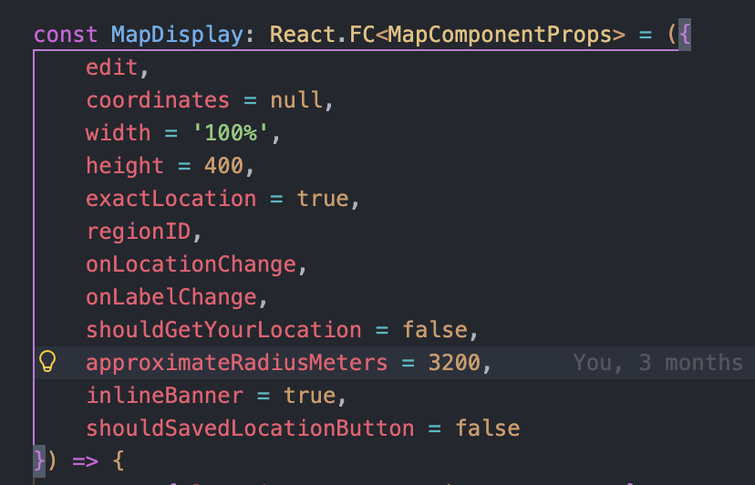
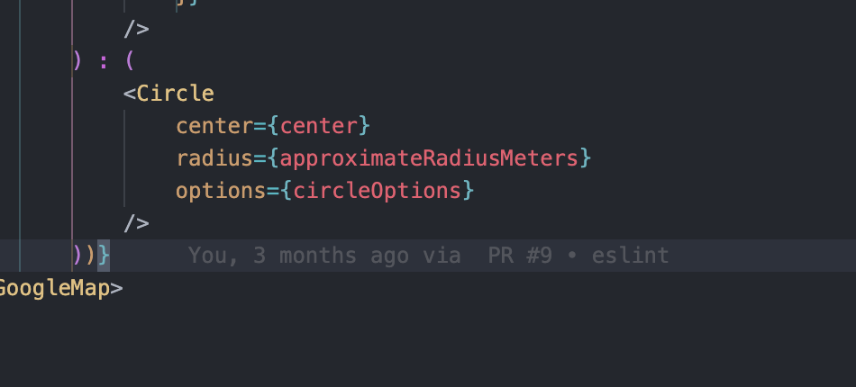
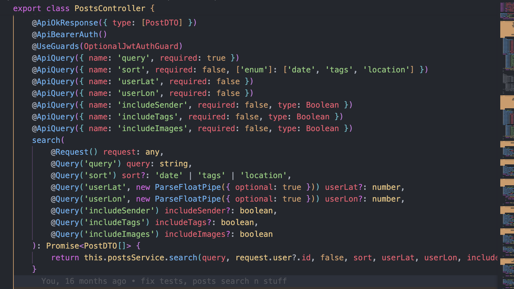
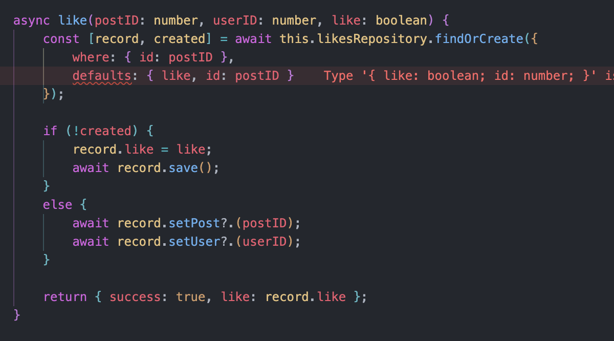
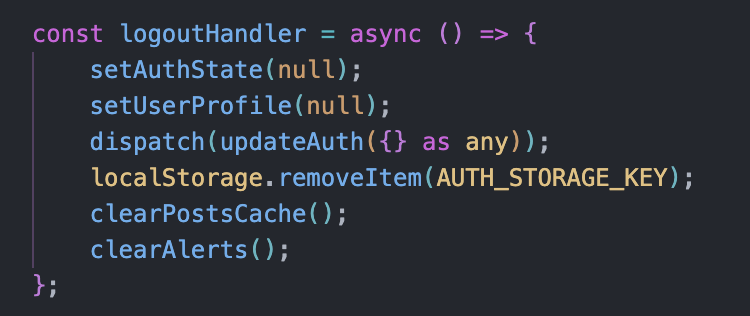

1. The circle around the location is too large in the post details page when you don't have a handshake. It should be only a few blocks

2. Post 404 when trying to like or dislike a post (backend fix probably?)

3. ( Might take longer, but will fill extra time, no need to finish ) when logging in to another user, it stays as the first user until i refresh. Doesn't happen 100% of the time but it happens enough

Login users:

1. `admin` - `admin`
2. `user2` - `password2`
3. `user3` - `password3`

